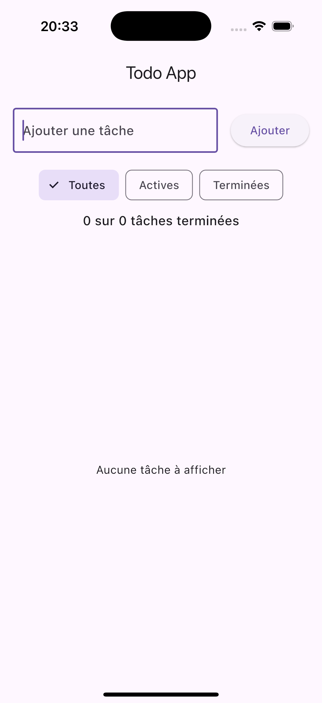

# Flutter Todo List Application

A minimalist yet functional Todo List application built with Flutter, demonstrating the use of stateless and stateful widgets.

## 📱 Features

- ✅ Create new tasks
- 🔄 Mark tasks as completed
- 🗑️ Delete tasks
- 🔍 Filter tasks (All/Active/Completed)
- 📊 Track task completion progress

## 🚀 Getting Started

### Prerequisites

- Flutter SDK (latest stable version)
- Dart SDK
- Android Studio / VS Code with Flutter extensions
- Git

### Installation

1. Clone the repository
```bash
git clone https://github.com/Cinex10/flutter_homework.git
```

2. Navigate to the project directory
```bash
cd flutter_homework
```

3. Get dependencies
```bash
flutter pub get
```

4. Run the app
```bash
flutter run
```

## 📁 Project Structure

```
lib/
├── main.dart           // Application entry point
├── screens/           // Main screens
│   └── home_page.dart
├── widgets/           // Reusable components
│   ├── todo_list.dart
│   ├── todo_item.dart
│   ├── add_todo_form.dart
│   ├── filter_buttons.dart
│   └── task_counter.dart
└── models/           // Data models
    └── todo.dart
```

## 🏗️ Architecture

The application follows a simple yet effective architecture:

- **Models**: Data structures
- **Screens**: Main application pages
- **Widgets**: Reusable UI components

### State Management

- Local state management using `setState`
- Centralized state in `HomePage`
- Props and callback pattern for widget communication

## 🎯 Widget Types

### Stateless Widgets
- `TodoItem`: Individual todo display
- `FilterButtons`: Filter options
- `TaskCounter`: Progress display

### Stateful Widgets
- `HomePage`: Main state container
- `AddTodoForm`: New todo input
- `TodoList`: Task list management

## 🛠️ Technical Stack

- Flutter SDK
- Dart programming language
- Material Design 3
- Built-in Flutter widgets

## 📱 Screenshots



## 👥 Authors

- Yassine Driss - *Initial work* - [Cinex10](https://github.com/Cinex10)

## 🙏 Acknowledgments

- Flutter team for the amazing framework
- Material Design for the UI guidelines
- All contributors who will help improve this project