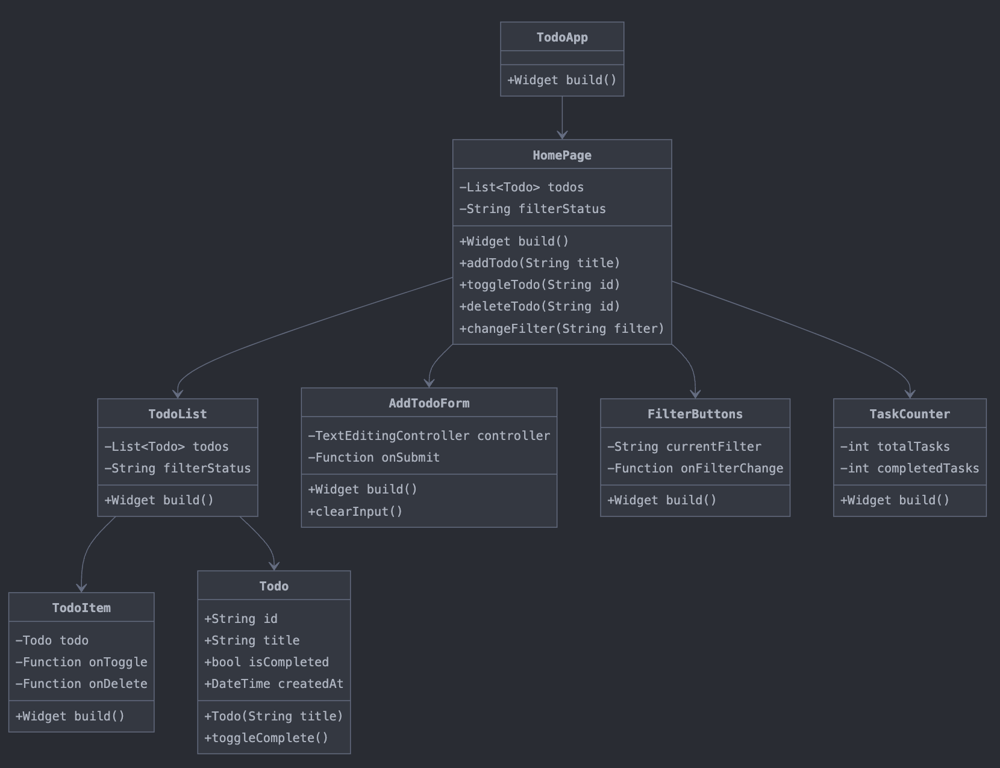
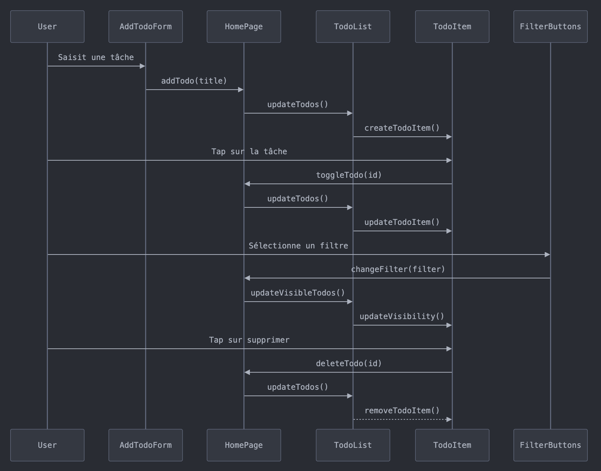
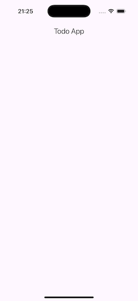
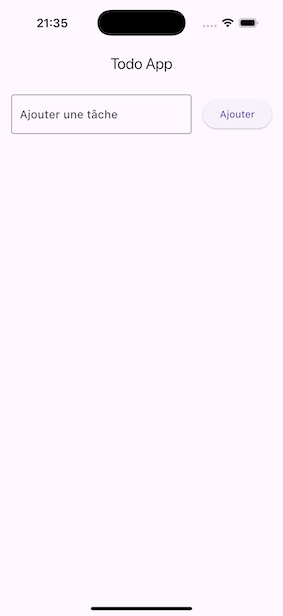
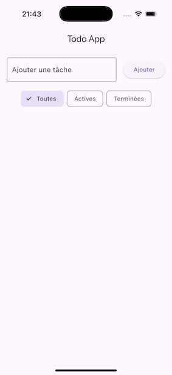
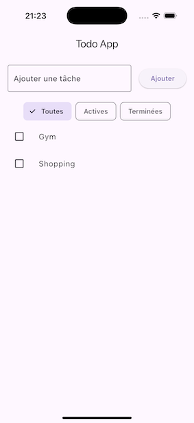
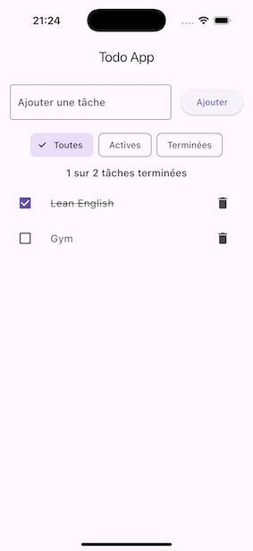

# Compte Rendu - Conception d'une Application Todo List en Flutter

## 1. Introduction

Ce document présente les choix de conception pour une application Todo List développée avec Flutter. L'objectif principal était de créer une application démontrant l'utilisation des widgets stateless et stateful tout en maintenant une architecture claire et maintenable.

## 2. Choix du Thème et Périmètre Fonctionnel

### 2.1 Thème Choisi
L'application Todo List a été choisie pour plusieurs raisons :
- Simplicité conceptuelle mais richesse des interactions
- Possibilité de démontrer clairement la différence entre états statiques et dynamiques
- Familiarité des utilisateurs avec ce type d'application
- Complexité adaptée à un TP d'introduction aux interfaces graphiques

### 2.2 Fonctionnalités Principales
- Ajout de nouvelles tâches
- Marquage des tâches comme terminées
- Suppression de tâches
- Filtrage des tâches (toutes/actives/terminées)
- Compteur de progression

## 3. Architecture Générale

### 3.1 Structure des Fichiers
```
lib/
├── main.dart           // Point d'entrée de l'application
├── screens/           // Pages principales
│   └── home_page.dart
├── widgets/           // Composants réutilisables
│   ├── todo_list.dart
│   ├── todo_item.dart
│   ├── add_todo_form.dart
│   ├── filter_buttons.dart
│   └── task_counter.dart
└── models/           // Modèles de données
    └── todo.dart
```

### 3.2 Justification de la Structure
- **Séparation des Responsabilités** : Chaque dossier a un rôle spécifique
- **Modularité** : Les composants sont indépendants et réutilisables
- **Maintenabilité** : Organisation claire facilitant les modifications futures
- **Scalabilité** : Structure permettant l'ajout facile de nouvelles fonctionnalités

## 4. Diagrammes de Conception

### 4.1 Diagramme de Classes
Le diagramme de classes montre l'organisation des différents composants et leurs relations :



Justification des choix :
- **Todo** : Modèle de données simple mais extensible
- **HomePage** : Point central de gestion d'état
- **Composants Stateless** : Pour l'affichage pur (TodoItem, FilterButtons, TaskCounter)
- **Composants Stateful** : Pour la gestion d'état local (AddTodoForm)

### 4.2 Diagramme de Séquences
Le diagramme de séquences illustre les principales interactions :



Points clés des interactions :
1. **Ajout de Tâche** : Flux unidirectionnel du formulaire vers la liste
2. **Modification d'État** : Propagation descendante des changements
3. **Filtrage** : Mise à jour réactive de l'affichage
4. **Suppression** : Gestion centralisée dans HomePage

## 5. Choix des Widgets

### 5.1 Widgets Stateless
- **TodoItem** : Affichage simple d'une tâche
- **FilterButtons** : Boutons de filtrage
- **TaskCounter** : Affichage du compteur
- **TodoApp** : Configuration de l'application

Justification : Ces widgets n'ont pas besoin de gérer leur propre état, ils reçoivent leurs données via des props.

### 5.2 Widgets Stateful
- **HomePage** : Gestion de l'état global
- **AddTodoForm** : Gestion du champ de texte
- **TodoList** : Gestion de l'affichage filtré

Justification : Ces widgets nécessitent une gestion d'état interne pour fonctionner correctement.

## 6. Gestion de l'État

### 6.1 Stratégie de Gestion
- État centralisé dans HomePage
- Propagation descendante des données
- Callbacks pour les actions remontantes

### 6.2 Avantages
- Simplicité de la logique de flux de données
- Facilité de débogage
- Performance optimisée
- Maintien de la cohérence des données

## 7. Évolution de l'Interface Utilisateur

### 7.1 Snapshots de l'Application

#### Snapshot 1 : Structure de Base



- Mise en place du Scaffold comme conteneur principal
- Ajout de l'AppBar avec le titre "Todo App"
- Interface minimaliste et claire
- Utilisation de Material Design 3

#### Snapshot 2 : Formulaire d'Ajout



- Intégration du champ de texte avec placeholder "Ajouter une tâche"
- Ajout du bouton "Ajouter" avec style Material
- Disposition en ligne (Row) pour une meilleure ergonomie
- Utilisation de padding et spacing appropriés

#### Snapshot 3 : Système de Filtrage



- Implémentation des boutons de filtrage (Toutes, Actives, Terminées)
- Utilisation de ToggleButtons pour une sélection claire
- Style visuel cohérent avec le reste de l'interface
- Feedback visuel de la sélection active

#### Snapshot 4 : Liste des Tâches



- Affichage des tâches ajoutées
- Implémentation des cases à cocher
- Compteur de progression (0 sur 2 tâches terminées)
- Utilisation de ListTile pour une présentation structurée

#### Snapshot 5 : Fonctionnalité de Suppression



- Ajout des boutons de suppression pour chaque tâche
- Mise à jour du compteur (1 sur 2 tâches terminées)
- Affichage barré pour les tâches terminées
- Interface complète et fonctionnelle

### 7.2 Évolution du Code

#### Snapshot 1 : Structure de Base
```dart
Scaffold(
  appBar: AppBar(
    title: const Text('Todo App'),
  ),
  body: Container(),
)
```

#### Snapshot 2 : Formulaire d'Ajout
```dart
Row(
  children: [
    Expanded(
      child: TextField(
        decoration: InputDecoration(
          hintText: 'Ajouter une tâche',
          border: OutlineInputBorder(),
        ),
      ),
    ),
    SizedBox(width: 16),
    ElevatedButton(
      onPressed: () {},
      child: Text('Ajouter'),
    ),
  ],
)
```

#### Snapshot 3 : Système de Filtrage
```dart
Row(
  mainAxisAlignment: MainAxisAlignment.center,
  children: [
    FilterChip(
      label: Text('Toutes'),
      selected: currentFilter == 'all',
      onSelected: (_) => onFilterChange('all'),
    ),
    SizedBox(width: 8),
    FilterChip(
      label: Text('Actives'),
      selected: currentFilter == 'active',
      onSelected: (_) => onFilterChange('active'),
    ),
    SizedBox(width: 8),
    FilterChip(
      label: Text('Terminées'),
      selected: currentFilter == 'completed',
      onSelected: (_) => onFilterChange('completed'),
    ),
  ],
)
```

#### Snapshot 4 : Liste des Tâches
```dart
ListView.builder(
  itemCount: todos.length,
  itemBuilder: (context, index) {
    final todo = todos[index];
    return ListTile(
      leading: Checkbox(
        value: todo.isCompleted,
        onChanged: (_) => onToggle(todo.id),
      ),
      title: Text(todo.title),
    );
  },
)
```

#### Snapshot 5 : Fonctionnalité de Suppression
```dart
ListTile(
  leading: Checkbox(
    value: todo.isCompleted,
    onChanged: (_) => onToggle(todo.id),
  ),
  title: Text(
    todo.title,
    style: TextStyle(
      decoration: todo.isCompleted ? 
        TextDecoration.lineThrough : null,
    ),
  ),
  trailing: IconButton(
    icon: Icon(Icons.delete),
    onPressed: () => onDelete(todo.id),
  ),
)
```

### 7.3 Design System

### 7.1 Design System
- Utilisation de Material Design 3
- Composants standard Flutter
- Styles cohérents
- Interfaces adaptatives

### 7.2 Expérience Utilisateur
- Feedback immédiat des actions
- Animations fluides
- Interface intuitive
- Gestion des erreurs


## 9. Conclusion

L'architecture choisie permet une démonstration claire des concepts de widgets stateless/stateful tout en maintenant une base de code organisée et maintenable. Les choix de conception favorisent la modularité et la réutilisabilité, tout en gardant une complexité adaptée au contexte d'un TP.